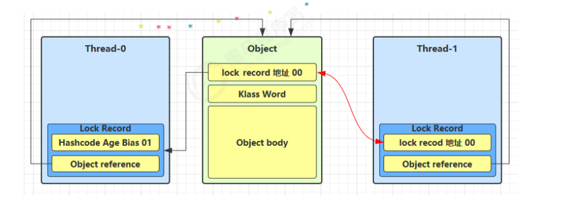
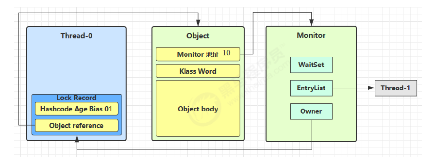

# CompletableFuture（异步线程）常用方法

_获取结果_

```
public T get()
public T get(long timeout,TimeUnit unit)
public T join() --->和get一样的作用，只是不需要抛出异常
public T getNow(T valuelfAbsent) --->计算完成就返回正常值，否则返回备胎值（传入的参数），立即获取结果不阻塞

```

_主动触发计算_

```

public boolean complete(T value) ---->是否打断get方法立即返回括号值

```

_对计算结果进行处理--CompletableFutureResult.java_

```angular2html

henApply --->计算结果存在依赖关系，这两个线程串行化---->由于存在依赖关系（当前步错，不走下一步），当前步骤有异常的话就叫停
handle --->计算结果存在依赖关系，这两个线程串行化---->有异常也可以往下走一步

```

_对计算结果进行消费--CompletableFutureApi2Demo.java_

```angular2html
接受任务的处理结果，并消费处理，无返回结果
thenAccept
```

_对比补充_

```angular2html
thenRun(Runnable runnable) :任务A执行完执行B，并且不需要A的结果
thenAccept(Consumer action): 任务A执行完执行B，B需要A的结果，但是任务B没有返回值
thenApply(Function fn): 任务A执行完执行B，B需要A的结果，同时任务B有返回值
```

_对计算速度进行选用--CompletableFutureApiDemo.java_

```angular2html
谁快用谁
applyToEither
```

_对计算结果进行合并--CompletableFutureApi3Demo.java_

```angular2html
两个CompletableStage任务都完成后，最终能把两个任务的结果一起交给thenCombine来处理
先完成的先等着，等待其他分支任务
```

# LockSupport类中的park等待和unpark唤醒---LockSupportDemo.java

_是什么_

LockSupport用于创建锁和其他同步类的基本线程阻塞原语

LockSupport类使用了一种名为Permit（许可）的概念来做到阻塞和唤醒线程的功能，每个线程都有一个许可（Permit），许可证只能有一个，累加上限是1。

_主要方法_

    阻塞: Peimit许可证默认没有不能放行，所以一开始调用park()方法当前线程会阻塞，直到别的线程给当前线程发放peimit，park方法才会被唤醒。
    park/park(Object blocker)-------阻塞当前线程/阻塞传入的具体线程

    唤醒: 调用unpack(thread)方法后 就会将thread线程的许可证peimit发放，会自动唤醒park线程，即之前阻塞中的LockSupport.park()方法会立即返回。
    unpark(Thread thread)------唤醒处于阻塞状态的指定线程


_和wait的区别_

    wait与notify执行时必须保证wait比notify先执行，如果notify比wait先执行就会导致wait休眠状态的线程无法唤醒；而park和unpark则不会
    我们可以先调用unpark来释放一个许可证，然后park去获取一个；另额park方法并不会释放锁。

_重点_

    LockSupport是用来创建锁和其他同步类的基本线程阻塞原语，所有的方法都是静态方法，可以让线程再任意位置阻塞，阻塞后也有对应的唤醒方法。归根结底，LockSupport时调用Unsafe中的native代码
    LockSupport提供park()和unpark()方法实现阻塞线程和解除线程阻塞的过程，LockSupport和每个使用它的线程都有一个许可（Peimit）关联，每个线程都有一个相关的permit，peimit最多只有一个，重复调用unpark也不会积累凭证。
    形象理解：线程阻塞需要消耗凭证（Permit），这个凭证最多只有一个
    当调用park时，如果有凭证，则会直接消耗掉这个凭证然后正常退出。如果没有凭证，则必须阻塞等待凭证可用；
    当调用unpark时，它会增加一个凭证，但凭证最多只能有1各，累加无效。

_面试_

    为什么LockSupport可以突破wait/notify的原有调用顺序？
    因为unpark获得了一个凭证，之后再调用park方法，就可以名正言顺的凭证消费，故不会阻塞，先发放了凭证后续可以畅通无阻。
    为什么唤醒两次后阻塞两次，但最终结果还会阻塞线程？
    因为凭证的数量最多为1，连续调用两次unpark和调用一次unpark效果一样，只会增加一个凭证，而调用两次park却需要消费两个凭证，证不够，不能放行。

# Callable接口的实现

```angular2html
1.定义一个线程任务类实现callable接口，申明线程执行结果类型。
2.重写线程任务类的call方法，这个方法可以直接返回执行结果。
3.创建一个Callable线程任务对象。
4.把Callable线程任务对象包装成一个未来任务对象。
5.把未来任务对象包装成线程对象。
6.调用线程start()方法启动线程。
```

_FutureTask方法_

```angular2html
FutureTask是Runnable对象，因为Thread类只能执行Runnable实例的任务对象，所以需要将Callable封装成未来任务对象。

优点：同 Runnable，并且能得到线程执行的结果
缺点：编码复杂

get() 线程会阻塞等待任务执行完成
run() 执行完后会把结果设置到 FutureTask 的一个成员变量，get() 线程可以获取到该变量的值
```

# Thread类API

```angular2html
public void start()	                       启动一个新线程，Java虚拟机调用此线程的 run 方法
public void run()	                       线程启动后调用该方法
public void setName(String name)	       给当前线程取名字
public void getName()	                   获取当前线程的名字
                                           线程存在默认名称：子线程是 Thread-索引，主线程是 main
public static Thread currentThread()	   获取当前线程对象，代码在哪个线程中执行
public static void sleep(long time)	       让当前线程休眠多少毫秒再继续执行
Thread.sleep(0) :                          让操作系统立刻重新进行一次 CPU 竞争
public static native void yield()	       提示线程调度器让出当前线程对 CPU 的使用
public final int getPriority()	           返回此线程的优先级
public final void setPriority(int priority)	更改此线程的优先级，常用 1 5 10
public void interrupt()	                   中断这个线程，异常处理机制
public static boolean interrupted()	       判断当前线程是否被打断，清除打断标记
public boolean isInterrupted()	           判断当前线程是否被打断，不清除打断标记
public final void join()	                   等待这个线程结束
public final void join(long millis)	       等待这个线程死亡 millis 毫秒，0 意味着永远等待
public final native boolean isAlive()	   线程是否存活（还没有运行完毕）
public final void setDaemon(boolean on)	   将此线程标记为守护线程或用户线程
```

_打断线程--interrupt_

```angular2html
public void interrupt()：打断这个线程，异常处理机制

public static boolean interrupted()：判断当前线程是否被打断，打断返回 true，清除打断标记，连续调用两次一定返回 false

public boolean isInterrupted()：判断当前线程是否被打断，不清除打断标记

打断的线程会发生上下文切换，操作系统会保存线程信息，抢占到 CPU 后会从中断的地方接着运行（打断不是停止）
```

sleep、wait、join 方法都会让线程进入阻塞状态，打断线程会清空打断状态（false）---InterruptDemo.java

打断正常运行的线程：不会清空打断状态（true）---InterruptDemo.java

_终止模式---TwoPhaseTerminationDemo.java_

终止模式之两阶段终止模式：Two Phase Termination

在一个线程 T1 中如何优雅终止线程 T2？优雅指的是给 T2 一个后置处理器

# 练习：两个线程依次输出1到100之间的数字

此处wait与notify顺序可以变换，其中notify是唤醒同一锁上正在等待的其他线程之一，而wait是让自己进入等待状态释放锁。

```java
public class AlternatePrint {

    private static final Object lock = new Object();
    private static int count = 1;

    public static void main(String[] args) {
        Thread t1 = new Thread(() -> {
            synchronized (lock) {
                while (count <= 100) {
                    System.out.println(Thread.currentThread().getName() + ": " + count++);
                    lock.notify();  // 通知t2继续执行
                    try {
                        if (count <= 100) {
                            lock.wait();  // 进入等待状态，等待t2的通知
                        }
                    } catch (InterruptedException e) {
                        e.printStackTrace();
                    }
                }
            }
        }, "Thread-1");

        Thread t2 = new Thread(() -> {
            synchronized (lock) {
                while (count <= 100) {
                    System.out.println(Thread.currentThread().getName() + ": " + count++);
                    lock.notify();  // 通知t1继续执行
                    try {
                        if (count <= 100) {
                            lock.wait();  // 进入等待状态，等待t1的通知
                        }
                    } catch (InterruptedException e) {
                        e.printStackTrace();
                    }
                }
            }
        }, "Thread-2");

        t1.start();
        t2.start();
    }
}
```

# **查看线程**

_Linux_

    ps -ef 查看所有进程
    ps -fT -p 查看某个进程（PID）的所有线程
    kill 杀死进程
    top 按大写 H 切换是否显示线程
    top -H -p 查看某个进程（PID）的所有线程

_Windows_

    任务管理器可以查看进程和线程数，也可以用来杀死进程
    tasklist 查看进程
    taskkill 杀死进程

_Java_

    jps 命令查看所有 Java 进程
    jstack 查看某个 Java 进程（PID）的所有线程状态
    jconsole 来查看某个 Java 进程中线程的运行情况（图形界面）


# **同步**

_synchronized---SynchronizedDemo.java_

锁对象：理论上是任意的唯一对象

synchronized是可重入，不公平的重量级锁

原则

    锁对象建议使用共享资源
    在实例中使用this作为锁对象，锁住this的正是共享资源
    在静态方法中使用类名.class字节码作为锁对象，因为静态变量属于类，被所有实例对象共享，所以需要锁住类。

```java
synchronized(锁对象){
    //访问共享资源核心代码
        }
```

_同步方法_

把出现安全问题的核心代码锁起来，每次只有一个线程进去访问。

synchronized 修饰的方法的不具备继承性，所以子类是线程不安全的，如果子类的方法也被 synchronized 修饰，两个锁对象其实是一把锁，而且是子类对象作为锁

```java
//同步方法
修饰符 synchronized 返回值类型 方法名(方法参数) { 
	方法体；
}
//同步静态方法
修饰符 static synchronized 返回值类型 方法名(方法参数) { 
	方法体；
}
```

如果方法是实例方法：同步方法默认this作为锁对象

```java
public synchronized void test(){} //等价于
public void test(){
    synchronized (this){
        
    }
}
```

如果方法是静态方法，同步方法默认使用类名.class作为锁对象

```java
class Test{
    public synchronized static void test(){}
}
//等价于
class Test{
    public void test(){
        synchronized (Test.class){
            
        }
    }
}
```

_线程八锁_

主要关注锁对象是不是同一个

锁住类对象，所有类的实例的方法都是安全的，类的所有实例都相当于同一把锁

锁住 this 对象，只有在当前实例对象的线程内是安全的，如果有多个实例就不安全

## 举例

因为 n1 调用 a() 方法，锁住的是类对象，n2 调用 b() 方法，锁住的也是类对象，所以线程安全

```java
class Test{
    public synchronized static void a(){
        Thread.sleep(1000);
        System.out.println("a");
    }
    public synchronized static void b(){ //此处若不加static则创建t2是会新建一个b()的方法导致t1和t2锁的对象不一致
        Thread.sleep(1000);
        System.out.println("b");
    }
}
public static void main(String[] args){
    Test t1 = new Test();
    Test t2 = new Test();
    new Thread(() -> {t1.a();}).start();
    new Thread(() -> {t2.b();}).start();
}
```

## 锁升级

### 升级过程

synchronized 是可重入、不公平的重量级锁，所以可以对其进行优化

```java
无锁 -> 偏向锁 -> 轻量级锁 -> 重量级锁  //随着竞争的增加，只能升级锁不能降级
```

### 偏向锁

偏向锁的思想是偏向于让第一个获取锁对象的线程，这个线程之后重新获取该锁不再需要同步操作：

当锁对象第一次被线程获得的时候进入偏向状态，标记为 101，同时使用 CAS 操作将线程 ID 记录到 Mark Word。如果 CAS 操作成功，这个线程以后进入这个锁相关的同步块，查看这个线程 ID 是自己的就表示没有竞争，就不需要再进行任何同步操作

当有另外一个线程去尝试获取这个锁对象时，偏向状态就宣告结束，此时撤销偏向（Revoke Bias）后恢复到未锁定或轻量级锁状态

一个对象创建时：

如果开启了偏向锁（默认开启），那么对象创建后，MarkWord 值为 0x05 即最后 3 位为 101，thread、epoch、age 都为 0

偏向锁是默认是延迟的，不会在程序启动时立即生效，如果想避免延迟，可以加 VM 参数 -XX:BiasedLockingStartupDelay=0 来禁用延迟。JDK 8 延迟 4s 开启偏向锁原因：在刚开始执行代码时，会有好多线程来抢锁，如果开偏向锁效率反而降低

当一个对象已经计算过 hashCode，就再也无法进入偏向状态了

添加 VM 参数 -XX:-UseBiasedLocking 禁用偏向锁

撤销偏向锁的状态：

调用对象的 hashCode：偏向锁的对象 MarkWord 中存储的是线程 id，调用 hashCode 导致偏向锁被撤销
当有其它线程使用偏向锁对象时，会将偏向锁升级为轻量级锁
调用 wait/notify，需要申请 Monitor，进入 WaitSet
批量撤销：如果对象被多个线程访问，但没有竞争，这时偏向了线程 T1 的对象仍有机会重新偏向 T2，重偏向会重置对象的 Thread ID

批量重偏向：当撤销偏向锁阈值超过 20 次后，JVM 会觉得是不是偏向错了，于是在给这些对象加锁时重新偏向至加锁线程

批量撤销：当撤销偏向锁阈值超过 40 次后，JVM 会觉得自己确实偏向错了，根本就不该偏向，于是整个类的所有对象都会变为不可偏向的，新建的对象也是不可偏向的

### 轻量级锁

一个对象被多个线程进行加锁，但加锁的时间是错开的（没有竞争），可以使用轻量级锁实现，轻量级锁对使用者是透明的（不可见）

可重入锁：线程可以进入任何一个它已经拥有的锁所同步的代码块，可重入锁最大的作用是避免死锁。

轻量级锁在没有竞争时（锁重入时），每次重入仍然需要执行 CAS 操作，Java 6 才引入的偏向锁来优化

_锁重入实例_

```java
static final Object obj = new Object();

public static void method1(){
    synchronized (obj){
        //同步块A
        method2();
    }
}

public static void method2(){
    synchronized (obj){
        //同步块B
    }
}
```

创建锁记录对象，每个线程的栈帧都会包含一个锁记录的结构，存储锁定对象的Mark Word

让锁记录中Object reference指向锁住的对象，并尝试用CAS替换Object的Mark Word，将Mark Word的值存入锁记录

如果CAS替换成功。对象头中存储了锁记录地址和状态00（轻量级锁），表示线程给对象加锁

如果CAS失败，有两种情况

    如果是其他线程已经持有了该Object的轻量级锁，这时表明有竞争，进入锁膨胀过程
    如果线程自己执行了synchronized锁重入，就添加一条Lock Record作为重入计数

当退出synchronized代码块（解锁时）

    如果有取值为null的锁记录，表示有重入，这时重置锁记录，表示重入计数减1
    如果锁记录不为null，这时使用CAS将Mark Word的值恢复给对象头
        成功，则解锁成功
        失败，说明轻量级锁进行了锁膨胀或已经升级为重量级锁，进入重量级锁解锁流程

### 锁膨胀

在尝试加轻量级锁的过程中，CAS操作无法成功。可能是其他线程为此对象加上了轻量级锁（有竞争）。这时需要进行锁膨胀，轻量级锁
变为重量级锁

当Thread-1进行轻量级加锁时，Thread-0已经对该对象加了轻量级锁



Thread-1加轻量级锁失败，进入锁膨胀流程：为Object对象申请Monitor锁。通过Object对象头获取到持锁线程。将Monitor的Owner
设置为Thread-0。将Object的对象头指向重量级锁地址，然后自己进入Monitor的EntryList BLOCKED



当线程Thread-0退出同步代码块解锁时，使用CAS将Mark Word的值恢复给对象头失败，这时进入重量级解锁流程，及按照Monitor地址找到
Monitor对象。设置Owner为null。唤醒EntryList中BLOCKED线程。

