# CompletableFuture（异步线程）常用方法

_获取结果_

```
public T get()
public T get(long timeout,TimeUnit unit)
public T join() --->和get一样的作用，只是不需要抛出异常
public T getNow(T valuelfAbsent) --->计算完成就返回正常值，否则返回备胎值（传入的参数），立即获取结果不阻塞

```

_主动触发计算_

```

public boolean complete(T value) ---->是否打断get方法立即返回括号值

```

_对计算结果进行处理--CompletableFutureResult.java_

```angular2html

henApply --->计算结果存在依赖关系，这两个线程串行化---->由于存在依赖关系（当前步错，不走下一步），当前步骤有异常的话就叫停
handle --->计算结果存在依赖关系，这两个线程串行化---->有异常也可以往下走一步

```

_对计算结果进行消费--CompletableFutureApi2Demo.java_

```angular2html
接受任务的处理结果，并消费处理，无返回结果
thenAccept
```

_对比补充_

```angular2html
thenRun(Runnable runnable) :任务A执行完执行B，并且不需要A的结果
thenAccept(Consumer action): 任务A执行完执行B，B需要A的结果，但是任务B没有返回值
thenApply(Function fn): 任务A执行完执行B，B需要A的结果，同时任务B有返回值
```

_对计算速度进行选用--CompletableFutureApiDemo.java_

```angular2html
谁快用谁
applyToEither
```

_对计算结果进行合并--CompletableFutureApi3Demo.java_

```angular2html
两个CompletableStage任务都完成后，最终能把两个任务的结果一起交给thenCombine来处理
先完成的先等着，等待其他分支任务
```

# LockSupport类中的park等待和unpark唤醒---LockSupportDemo.java

_是什么_

LockSupport用于创建锁和其他同步类的基本线程阻塞原语

LockSupport类使用了一种名为Permit（许可）的概念来做到阻塞和唤醒线程的功能，每个线程都有一个许可（Permit），许可证只能有一个，累加上限是1。

_主要方法_

    阻塞: Peimit许可证默认没有不能放行，所以一开始调用park()方法当前线程会阻塞，直到别的线程给当前线程发放peimit，park方法才会被唤醒。
    park/park(Object blocker)-------阻塞当前线程/阻塞传入的具体线程

    唤醒: 调用unpack(thread)方法后 就会将thread线程的许可证peimit发放，会自动唤醒park线程，即之前阻塞中的LockSupport.park()方法会立即返回。
    unpark(Thread thread)------唤醒处于阻塞状态的指定线程


_和wait的区别_

    wait与notify执行时必须保证wait比notify先执行，如果notify比wait先执行就会导致wait休眠状态的线程无法唤醒；而park和unpark则不会
    我们可以先调用unpark来释放一个许可证，然后park去获取一个；另额park方法并不会释放锁。

_重点_

    LockSupport是用来创建锁和其他同步类的基本线程阻塞原语，所有的方法都是静态方法，可以让线程再任意位置阻塞，阻塞后也有对应的唤醒方法。归根结底，LockSupport时调用Unsafe中的native代码
    LockSupport提供park()和unpark()方法实现阻塞线程和解除线程阻塞的过程，LockSupport和每个使用它的线程都有一个许可（Peimit）关联，每个线程都有一个相关的permit，peimit最多只有一个，重复调用unpark也不会积累凭证。
    形象理解：线程阻塞需要消耗凭证（Permit），这个凭证最多只有一个
    当调用park时，如果有凭证，则会直接消耗掉这个凭证然后正常退出。如果没有凭证，则必须阻塞等待凭证可用；
    当调用unpark时，它会增加一个凭证，但凭证最多只能有1各，累加无效。

_面试_

    为什么LockSupport可以突破wait/notify的原有调用顺序？
    因为unpark获得了一个凭证，之后再调用park方法，就可以名正言顺的凭证消费，故不会阻塞，先发放了凭证后续可以畅通无阻。
    为什么唤醒两次后阻塞两次，但最终结果还会阻塞线程？
    因为凭证的数量最多为1，连续调用两次unpark和调用一次unpark效果一样，只会增加一个凭证，而调用两次park却需要消费两个凭证，证不够，不能放行。

# Callable接口的实现

```angular2html
1.定义一个线程任务类实现callable接口，申明线程执行结果类型。
2.重写线程任务类的call方法，这个方法可以直接返回执行结果。
3.创建一个Callable线程任务对象。
4.把Callable线程任务对象包装成一个未来任务对象。
5.把未来任务对象包装成线程对象。
6.调用线程start()方法启动线程。
```

_FutureTask方法_

```angular2html
FutureTask是Runnable对象，因为Thread类只能执行Runnable实例的任务对象，所以需要将Callable封装成未来任务对象。

优点：同 Runnable，并且能得到线程执行的结果
缺点：编码复杂

get() 线程会阻塞等待任务执行完成
run() 执行完后会把结果设置到 FutureTask 的一个成员变量，get() 线程可以获取到该变量的值
```

# Thread类API

```angular2html
public void start()	                       启动一个新线程，Java虚拟机调用此线程的 run 方法
public void run()	                       线程启动后调用该方法
public void setName(String name)	       给当前线程取名字
public void getName()	                   获取当前线程的名字
                                           线程存在默认名称：子线程是 Thread-索引，主线程是 main
public static Thread currentThread()	   获取当前线程对象，代码在哪个线程中执行
public static void sleep(long time)	       让当前线程休眠多少毫秒再继续执行
Thread.sleep(0) :                          让操作系统立刻重新进行一次 CPU 竞争
public static native void yield()	       提示线程调度器让出当前线程对 CPU 的使用
public final int getPriority()	           返回此线程的优先级
public final void setPriority(int priority)	更改此线程的优先级，常用 1 5 10
public void interrupt()	                   中断这个线程，异常处理机制
public static boolean interrupted()	       判断当前线程是否被打断，清除打断标记
public boolean isInterrupted()	           判断当前线程是否被打断，不清除打断标记
public final void join()	                   等待这个线程结束
public final void join(long millis)	       等待这个线程死亡 millis 毫秒，0 意味着永远等待
public final native boolean isAlive()	   线程是否存活（还没有运行完毕）
public final void setDaemon(boolean on)	   将此线程标记为守护线程或用户线程
```

_打断线程--interrupt_

```angular2html
public void interrupt()：打断这个线程，异常处理机制

public static boolean interrupted()：判断当前线程是否被打断，打断返回 true，清除打断标记，连续调用两次一定返回 false

public boolean isInterrupted()：判断当前线程是否被打断，不清除打断标记

打断的线程会发生上下文切换，操作系统会保存线程信息，抢占到 CPU 后会从中断的地方接着运行（打断不是停止）
```

sleep、wait、join 方法都会让线程进入阻塞状态，打断线程会清空打断状态（false）---InterruptDemo.java

打断正常运行的线程：不会清空打断状态（true）---InterruptDemo.java

_终止模式---TwoPhaseTerminationDemo.java_

终止模式之两阶段终止模式：Two Phase Termination

在一个线程 T1 中如何优雅终止线程 T2？优雅指的是给 T2 一个后置处理器

# 练习：两个线程依次输出1到100之间的数字

此处wait与notify顺序可以变换，其中notify是唤醒同一锁上正在等待的其他线程之一，而wait是让自己进入等待状态释放锁。

```java
public class AlternatePrint {

    private static final Object lock = new Object();
    private static int count = 1;

    public static void main(String[] args) {
        Thread t1 = new Thread(() -> {
            synchronized (lock) {
                while (count <= 100) {
                    System.out.println(Thread.currentThread().getName() + ": " + count++);
                    lock.notify();  // 通知t2继续执行
                    try {
                        if (count <= 100) {
                            lock.wait();  // 进入等待状态，等待t2的通知
                        }
                    } catch (InterruptedException e) {
                        e.printStackTrace();
                    }
                }
            }
        }, "Thread-1");

        Thread t2 = new Thread(() -> {
            synchronized (lock) {
                while (count <= 100) {
                    System.out.println(Thread.currentThread().getName() + ": " + count++);
                    lock.notify();  // 通知t1继续执行
                    try {
                        if (count <= 100) {
                            lock.wait();  // 进入等待状态，等待t1的通知
                        }
                    } catch (InterruptedException e) {
                        e.printStackTrace();
                    }
                }
            }
        }, "Thread-2");

        t1.start();
        t2.start();
    }
}
```

# **查看线程**

_Linux_

    ps -ef 查看所有进程
    ps -fT -p 查看某个进程（PID）的所有线程
    kill 杀死进程
    top 按大写 H 切换是否显示线程
    top -H -p 查看某个进程（PID）的所有线程

_Windows_

    任务管理器可以查看进程和线程数，也可以用来杀死进程
    tasklist 查看进程
    taskkill 杀死进程

_Java_

    jps 命令查看所有 Java 进程
    jstack 查看某个 Java 进程（PID）的所有线程状态
    jconsole 来查看某个 Java 进程中线程的运行情况（图形界面）


# **同步**

# 同步--synchronized---SynchronizedDemo.java

锁对象：理论上是任意的唯一对象

synchronized是可重入，不公平的重量级锁

原则

    锁对象建议使用共享资源
    在实例中使用this作为锁对象，锁住this的正是共享资源
    在静态方法中使用类名.class字节码作为锁对象，因为静态变量属于类，被所有实例对象共享，所以需要锁住类。

```java
synchronized(锁对象){
    //访问共享资源核心代码
        }
```

### 同步方法

把出现安全问题的核心代码锁起来，每次只有一个线程进去访问。

synchronized 修饰的方法的不具备继承性，所以子类是线程不安全的，如果子类的方法也被 synchronized 修饰，两个锁对象其实是一把锁，而且是子类对象作为锁

```java
//同步方法
修饰符 synchronized 返回值类型 方法名(方法参数) { 
	方法体；
}
//同步静态方法
修饰符 static synchronized 返回值类型 方法名(方法参数) { 
	方法体；
}
```

如果方法是实例方法：同步方法默认this作为锁对象

```java
public synchronized void test(){} //等价于
public void test(){
    synchronized (this){
        
    }
}
```

如果方法是静态方法，同步方法默认使用类名.class作为锁对象

```java
class Test{
    public synchronized static void test(){}
}
//等价于
class Test{
    public void test(){
        synchronized (Test.class){
            
        }
    }
}
```

### 线程八锁

主要关注锁对象是不是同一个

锁住类对象，所有类的实例的方法都是安全的，类的所有实例都相当于同一把锁

锁住 this 对象，只有在当前实例对象的线程内是安全的，如果有多个实例就不安全

## 举例

因为 n1 调用 a() 方法，锁住的是类对象，n2 调用 b() 方法，锁住的也是类对象，所以线程安全

```java
class Test{
    public synchronized static void a(){
        Thread.sleep(1000);
        System.out.println("a");
    }
    public synchronized static void b(){ //此处若不加static则创建t2是会新建一个b()的方法导致t1和t2锁的对象不一致
        Thread.sleep(1000);
        System.out.println("b");
    }
}
public static void main(String[] args){
    Test t1 = new Test();
    Test t2 = new Test();
    new Thread(() -> {t1.a();}).start();
    new Thread(() -> {t2.b();}).start();
}
```

## 锁原理

### Monitor

Monitor 被翻译为监视器或管程

每个 Java 对象都可以关联一个 Monitor 对象，Monitor 也是 class，其实例存储在堆中，如果使用 synchronized 给对象上锁（重量级）之后，该对象头的 Mark Word 中就被设置指向 Monitor 对象的指针，这就是重量级锁

Mark Word 结构：最后两位是锁标志位

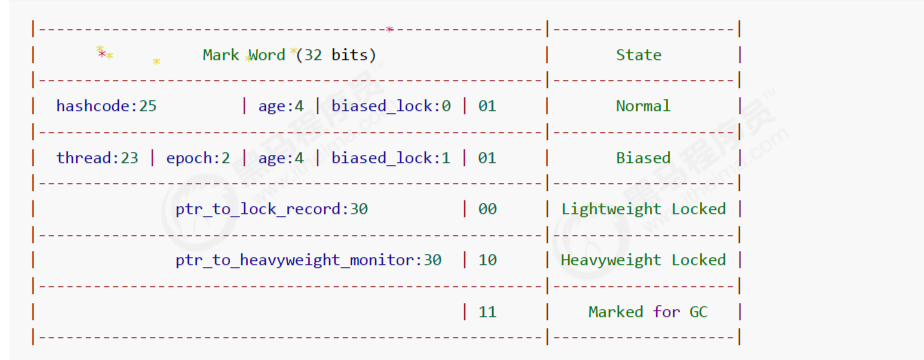

64 位虚拟机 Mark Word：

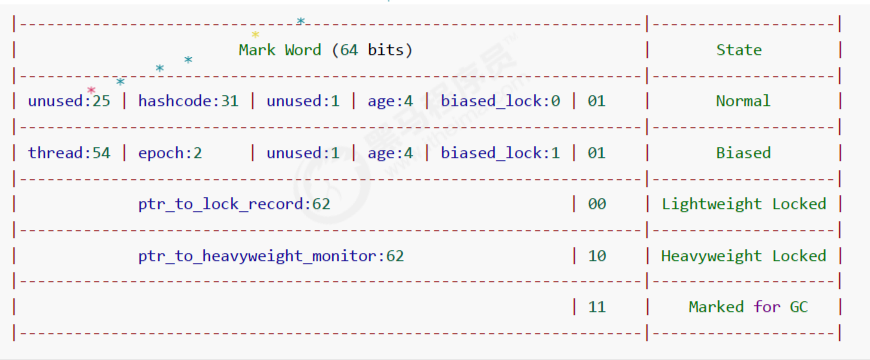

工作流程：

开始时 Monitor 中 Owner 为 null

当 Thread-2 执行 synchronized(obj) 就会将 Monitor 的所有者 Owner 置为 Thread-2，Monitor 中只能有一个 Owner，obj 对象的 Mark Word 指向 Monitor，把对象原有的 MarkWord 存入线程栈中的锁记录中（轻量级锁部分详解）

在 Thread-2 上锁的过程，Thread-3、Thread-4、Thread-5 也执行 synchronized(obj)，就会进入 EntryList BLOCKED（双向链表）

Thread-2 执行完同步代码块的内容，根据 obj 对象头中 Monitor 地址寻找，设置 Owner 为空，把线程栈的锁记录中的对象头的值设置回 MarkWord

唤醒 EntryList 中等待的线程来竞争锁，竞争是非公平的，如果这时有新的线程想要获取锁，可能直接就抢占到了，阻塞队列的线程就会继续阻塞

WaitSet 中的 Thread-0，是以前获得过锁，但条件不满足进入 WAITING 状态的线程（wait-notify 机制）


## 锁升级

### 升级过程

synchronized 是可重入、不公平的重量级锁，所以可以对其进行优化

```java
无锁 -> 偏向锁 -> 轻量级锁 -> 重量级锁  //随着竞争的增加，只能升级锁不能降级
```

### 偏向锁

偏向锁的思想是偏向于让第一个获取锁对象的线程，这个线程之后重新获取该锁不再需要同步操作：

当锁对象第一次被线程获得的时候进入偏向状态，标记为 101，同时使用 CAS 操作将线程 ID 记录到 Mark Word。如果 CAS 操作成功，这个线程以后进入这个锁相关的同步块，查看这个线程 ID 是自己的就表示没有竞争，就不需要再进行任何同步操作

当有另外一个线程去尝试获取这个锁对象时，偏向状态就宣告结束，此时撤销偏向（Revoke Bias）后恢复到未锁定或轻量级锁状态

一个对象创建时：

如果开启了偏向锁（默认开启），那么对象创建后，MarkWord 值为 0x05 即最后 3 位为 101，thread、epoch、age 都为 0

偏向锁是默认是延迟的，不会在程序启动时立即生效，如果想避免延迟，可以加 VM 参数 -XX:BiasedLockingStartupDelay=0 来禁用延迟。JDK 8 延迟 4s 开启偏向锁原因：在刚开始执行代码时，会有好多线程来抢锁，如果开偏向锁效率反而降低

当一个对象已经计算过 hashCode，就再也无法进入偏向状态了

添加 VM 参数 -XX:-UseBiasedLocking 禁用偏向锁

撤销偏向锁的状态：

调用对象的 hashCode：偏向锁的对象 MarkWord 中存储的是线程 id，调用 hashCode 导致偏向锁被撤销
当有其它线程使用偏向锁对象时，会将偏向锁升级为轻量级锁
调用 wait/notify，需要申请 Monitor，进入 WaitSet
批量撤销：如果对象被多个线程访问，但没有竞争，这时偏向了线程 T1 的对象仍有机会重新偏向 T2，重偏向会重置对象的 Thread ID

批量重偏向：当撤销偏向锁阈值超过 20 次后，JVM 会觉得是不是偏向错了，于是在给这些对象加锁时重新偏向至加锁线程

批量撤销：当撤销偏向锁阈值超过 40 次后，JVM 会觉得自己确实偏向错了，根本就不该偏向，于是整个类的所有对象都会变为不可偏向的，新建的对象也是不可偏向的

### 轻量级锁

一个对象被多个线程进行加锁，但加锁的时间是错开的（没有竞争），可以使用轻量级锁实现，轻量级锁对使用者是透明的（不可见）

可重入锁：线程可以进入任何一个它已经拥有的锁所同步的代码块，可重入锁最大的作用是避免死锁。

轻量级锁在没有竞争时（锁重入时），每次重入仍然需要执行 CAS 操作，Java 6 才引入的偏向锁来优化

_锁重入实例_

```java
static final Object obj = new Object();

public static void method1(){
    synchronized (obj){
        //同步块A
        method2();
    }
}

public static void method2(){
    synchronized (obj){
        //同步块B
    }
}
```

创建锁记录对象，每个线程的栈帧都会包含一个锁记录的结构，存储锁定对象的Mark Word

让锁记录中Object reference指向锁住的对象，并尝试用CAS替换Object的Mark Word，将Mark Word的值存入锁记录

如果CAS替换成功。对象头中存储了锁记录地址和状态00（轻量级锁），表示线程给对象加锁

如果CAS失败，有两种情况

    如果是其他线程已经持有了该Object的轻量级锁，这时表明有竞争，进入锁膨胀过程
    如果线程自己执行了synchronized锁重入，就添加一条Lock Record作为重入计数

当退出synchronized代码块（解锁时）

    如果有取值为null的锁记录，表示有重入，这时重置锁记录，表示重入计数减1
    如果锁记录不为null，这时使用CAS将Mark Word的值恢复给对象头
        成功，则解锁成功
        失败，说明轻量级锁进行了锁膨胀或已经升级为重量级锁，进入重量级锁解锁流程

### 锁膨胀

在尝试加轻量级锁的过程中，CAS操作无法成功。可能是其他线程为此对象加上了轻量级锁（有竞争）。这时需要进行锁膨胀，轻量级锁
变为重量级锁

当Thread-1进行轻量级加锁时，Thread-0已经对该对象加了轻量级锁

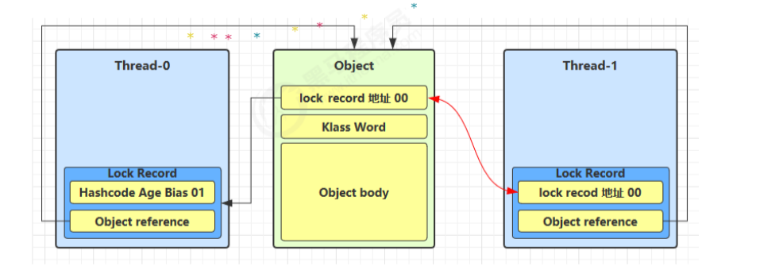

Thread-1加轻量级锁失败，进入锁膨胀流程：为Object对象申请Monitor锁。通过Object对象头获取到持锁线程。将Monitor的Owner
设置为Thread-0。将Object的对象头指向重量级锁地址，然后自己进入Monitor的EntryList BLOCKED

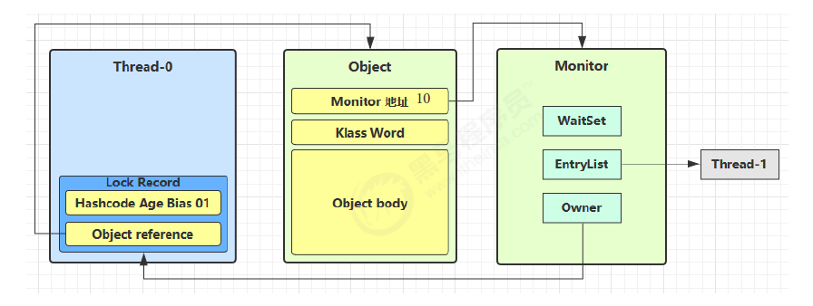

当线程Thread-0退出同步代码块解锁时，使用CAS将Mark Word的值恢复给对象头失败，这时进入重量级解锁流程，及按照Monitor地址找到
Monitor对象。设置Owner为null。唤醒EntryList中BLOCKED线程。

### 锁优化

重量级锁竞争时，尝试获取锁的线程不会立即阻塞，可以使用自旋（默认10次）来进行优化。采用循环的方式尝试获取锁

_注意_

    自旋锁占用CPU时间，单核CPU自旋就是在浪费时间，因为同一时刻只能运行一个线程，多核CPU自旋才能发挥优势
    自旋失败的线程进入阻塞状态

优点：不会进入阻塞状态，减少线程上下文切换消耗
缺点：当自旋的线程越来越多时，会不断消耗CPU资源

_自旋锁情况_

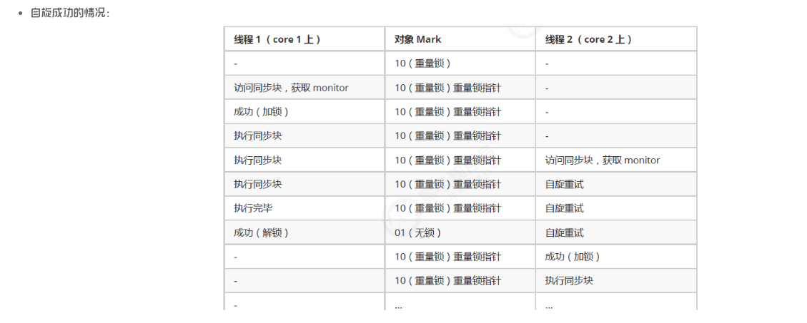

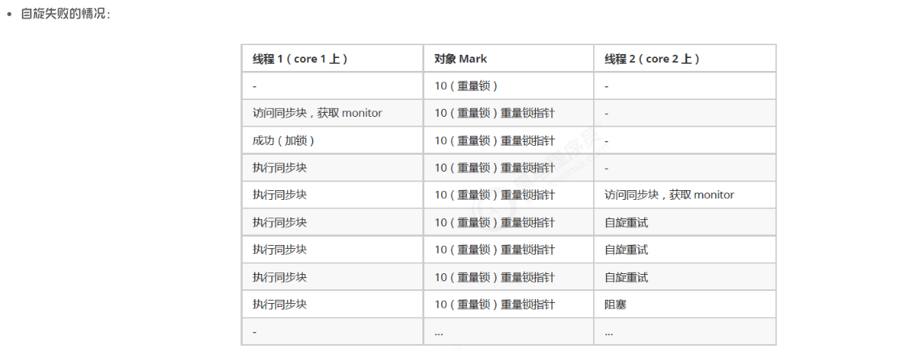

### 手写自旋锁---SpinLock.java

### 锁消除

锁消除是指对于被检测出不可能存在竞争的共享数据的锁进行消除，这是 JVM 即时编译器的优化

锁消除主要是通过逃逸分析来支持，如果堆上的共享数据不可能逃逸出去被其它线程访问到，那么就可以把它们当成私有数据对待，也就可以将它们的锁进行消除（同步消除：JVM 逃逸分析）

### 锁相化

对相同对象多次加锁，导致线程发生多次重入，频繁的加锁操作就会导致性能消耗，可以使用锁相化方式优化

如果虚拟机探测到一串的操作都对同一个对象加锁，将会把加锁的范围扩展到整个操作序列的外部

一些看起来没有加锁的代码，其实隐式的加了很多锁

```java
public static String concatString(String s1, String s2, String s3) {
    return s1 + s2 + s3;
}
```

String 是一个不可变的类，编译器会对 String 的拼接自动优化。在 JDK 1.5 之前，转化为 StringBuffer 对象的连续 append() 操作，每个 append() 方法中都有一个同步块

```java
public static String concatString(String s1, String s2, String s3) {
    StringBuffer sb = new StringBuffer();
    sb.append(s1);
    sb.append(s2);
    sb.append(s3);
    return sb.toString();
}
```

扩展到第一个 append() 操作之前直至最后一个 append() 操作之后，只需要加锁一次就可以

## 多把锁

多把不想干的锁：例如一间房子中有两个功能，一个是睡觉，一个是学习，但是只有一间房间（一个对象锁）供使用，那么并发度很低。

将锁的粒度细分：
    
    好处：可以增加并发度
    坏处：如果一个线程需要同时获取多把锁，很容易发生死锁

解决办法：准备多个对象锁

```java
public static void main(String[] args){
    
}
class Room {  
    private final Object sleepRoom = new Object();
    private final Object studyRoom = new Object();
    
    public void sleep() throws Exception{
        synchronized (sleepRoom){
            System.out.println("sleep 2 小时");
            Thread.sleep(2000);
        }
    }
    
    public void study() throws Exception{
        synchronized (studyRoom){
            System.out.println("study 1 小时");
            Thread.sleep(1000);
        }
    }
}
```

## 活跃性

### 死锁---Dead.java

死锁：多个线程同时被阻塞，它们中的一个或者全部都在等待某个资源被释放，由于线程被无限期地阻塞，因此程序不可能正常终止

Java 死锁产生的四个必要条件：

互斥条件，即当资源被一个线程使用（占有）时，别的线程不能使用

不可剥夺条件，资源请求者不能强制从资源占有者手中夺取资源，资源只能由资源占有者主动释放

请求和保持条件，即当资源请求者在请求其他的资源的同时保持对原有资源的占有

循环等待条件，即存在一个等待循环队列：p1 要 p2 的资源，p2 要 p1 的资源，形成了一个等待环路

四个条件都成立的时候，便形成死锁。死锁情况下打破上述任何一个条件，便可让死锁消失

### `rgb(9, 105, 218) 定位---以Dead.java文件为例`

使用 jps 定位进程 id，再用 jstack id 定位死锁，找到死锁的线程去查看源码，解决优化

Linux 下可以通过 top 先定位到 CPU 占用高的 Java 进程，再利用 top -Hp 进程id 来定位是哪个线程，最后再用 jstack 的输出来看各个线程栈

避免死锁：避免死锁要注意加锁顺序

可以使用 jconsole 工具，在 jdk\bin 目录下

### 活锁---TestLiveLock.java

活锁：指的是任务或者执行者没有被阻塞，由于某些条件没有满足，导致一直重复尝试—失败—尝试—失败的过程

两个线程互相改变对方的结束条件，最后谁也无法结束：

### 饥饿

饥饿：一个线程由于优先级太低，始终得不到 CPU 调度执行，也不能够结束

# 同步--Wait-ify

## 基本使用

需要获取对象锁后才可以调用 锁对象.wait()，notify 随机唤醒一个线程，notifyAll 唤醒所有线程去竞争 CPU

Object类API：

```java
public final void notify():唤醒正在等待对象监视器的单个线程。
public final void notifyAll():唤醒正在等待对象监视器的所有线程。
public final void wait():导致当前线程等待，直到另一个线程调用该对象的notify()方法或 notifyAll()方法。
public final native void wait(long timeout):有时限的等待, 到n毫秒后结束等待，或是被唤醒
```

说明：wait 是挂起线程，需要唤醒的都是挂起操作，阻塞线程可以自己去争抢锁，挂起的线程需要唤醒后去争抢锁

对比sleep()：

    原理不同：sleep() 方法是属于 Thread 类，是线程用来控制自身流程的，使此线程暂停执行一段时间而把执行机会让给其他线程；wait() 方法属于 Object 类，用于线程间通信
    对锁的处理机制不同：调用 sleep() 方法的过程中，线程不会释放对象锁，当调用 wait() 方法的时候，线程会放弃对象锁，进入等待此对象的等待锁定池（不释放锁其他线程怎么抢占到锁执行唤醒操作），但是都会释放 CPU
    使用区域不同：wait() 方法必须放在**同步控制方法和同步代码块（先获取锁）**中使用，sleep() 方法则可以放在任何地方使用

底层原理：

    Owner 线程发现条件不满足，调用 wait 方法，即可进入 WaitSet 变为 WAITING 状态
    BLOCKED 和 WAITING 的线程都处于阻塞状态，不占用 CPU 时间片
    BLOCKED 线程会在 Owner 线程释放锁时唤醒
    WAITING 线程会在 Owner 线程调用 notify 或 notifyAll 时唤醒，唤醒后并不意味者立刻获得锁，需要进入 EntryList 重新竞争

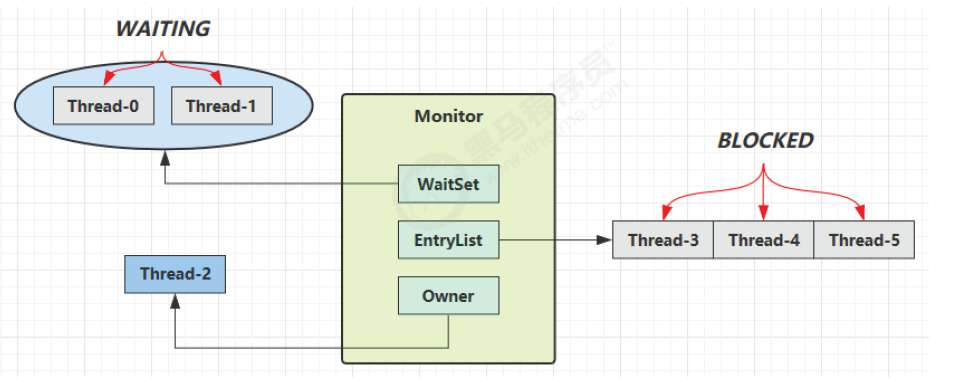

## 代码优化---NotifyAllDemo.java

虚假唤醒：notify 只能随机唤醒一个 WaitSet 中的线程，这时如果有其它线程也在等待，那么就可能唤醒不了正确的线程

解决方法：采用 notifyAll

notifyAll 仅解决某个线程的唤醒问题，使用 if + wait 判断仅有一次机会，一旦条件不成立，无法重新判断

解决方法：用 while + wait，当条件不成立，再次 wait

# 同步--park-un

LockSupport 是用来创建锁和其他同步类的线程原语

LockSupport 类方法：

LockSupport.park()：暂停当前线程，挂起原语

LockSupport.unpark(暂停的线程对象)：恢复某个线程的运行

```java
public static void main(String[] args) {
    Thread t1 = new Thread(() -> {
        System.out.println("start...");	//1
		Thread.sleep(1000);// Thread.sleep(3000)
        // 先 park 再 unpark 和先 unpark 再 park 效果一样，都会直接恢复线程的运行
        System.out.println("park...");	//2
        LockSupport.park();
        System.out.println("resume...");//4
    },"t1");
    t1.start();
   	Thread.sleep(2000);
    System.out.println("unpark...");	//3
    LockSupport.unpark(t1);
}
```

LockSupport 出现就是为了增强 wait & notify 的功能

    wait，notify 和 notifyAll 必须配合 Object Monitor 一起使用，而 park、unpark 不需要
    park & unpark 以线程为单位来阻塞和唤醒线程，而 notify 只能随机唤醒一个等待线程，notifyAll 是唤醒所有等待线程
    park & unpark 可以先 unpark，而 wait & notify 不能先 notify。类比生产消费，先消费发现有产品就消费，没有就等待；先生产就直接产生商品，然后线程直接消费
    wait 会释放锁资源进入等待队列，park 不会释放锁资源，只负责阻塞当前线程，会释放 CPU

原理：类似生产者消费者:

- 先park：
  - 当前线程调用 Unsafe.park() 方法
  - 检查 _counter ，本情况为 0，这时获得 _mutex 互斥锁
  - 线程进入 _cond 条件变量挂起
  - 调用 Unsafe.unpark(Thread_0) 方法，设置 _counter 为 1
  - 唤醒 _cond 条件变量中的 Thread_0，Thread_0 恢复运行，设置 _counter 为 0

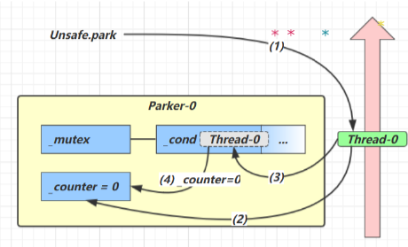

- 先unpark:
  - 调用 Unsafe.unpark(Thread_0) 方法，设置 _counter 为 1
  - 当前线程调用 Unsafe.park() 方法
  - 检查 _counter ，本情况为 1，这时线程无需挂起，继续运行，设置 _counter 为 0

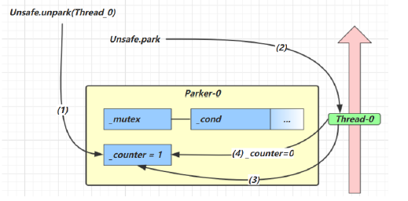

# 同步--安全分析

成员变量和静态变量：
  - 如果他们没有共享，则线程安全
  - 如果它们被共享了，根据他们的状态是否改变，分两种情况：
     - 如果只有读操作，线程安全
     - 如果有读写操作，则这段代码是临界区，需要考虑线程安全的问题

局部变量：
  - 局部变量是线性安全的
  - 局部变量引用的对象不一定线程安全（逃离分析）：
     - 如果该对象没有逃离方法的作用访问，它是线程安全的（每一个方法有一个栈帧）
     - 如果该对象逃离方法的作用范围，需要考虑线程安全问题（暴露引用）

常见线程安全类：String、Integer、StringBuffer、Random、Vector、Hashtable、java.util.concurrent 包

线程安全的是指，多个线程调用它们同一个实例的某个方法时，是线程安全的

每个方法是原子的，但多个方法的组合不是原子的，只能保证调用的方法内部安全

无状态类线程安全，就是没有成员变量的类

不可变类线程安全：String、Integer 等都是不可变类，内部的状态不可以改变，所以方法是线程安全

replace 等方法底层是新建一个对象，复制过去

抽象方法如果有参数，被重写后行为不确定可能造成线程不安全，被称之为外星方法：`public abstract foo(Student s)`;

# 同步--同步模式

## 保护性暂停

### 单任务版--GuardedObject.java

Guarded Suspension，用在一个线程等待另一个线程的执行结果

    有一个结果需要从一个线程传递到另一个线程，让它们关联同一个 GuardedObject
    如果有结果不断从一个线程到另一个线程那么可以使用消息队列（见生产者/消费者）
    JDK 中，join 的实现、Future 的实现，采用的就是此模式

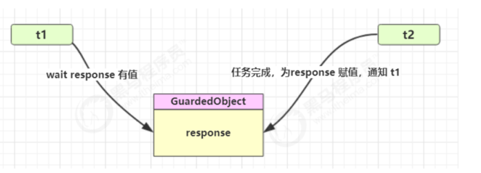

### 多任务版

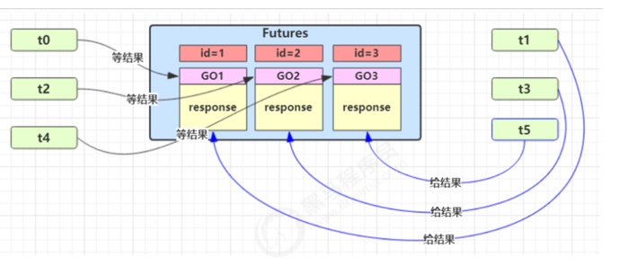

举例

```java
public static void main(String[] args) throws InterruptedException {
    for (int i = 0; i < 3; i++) {
        new People().start();
    }
    Thread.sleep(1000);
    for (Integer id : Mailboxes.getIds()) {
        new Postman(id, id + "号快递到了").start();
    }
}

@Slf4j(topic = "c.People")
class People extends Thread{
    @Override
    public void run() {
        // 收信
        GuardedObject guardedObject = Mailboxes.createGuardedObject();
        log.debug("开始收信i d:{}", guardedObject.getId());
        Object mail = guardedObject.get(5000);
        log.debug("收到信id:{}，内容:{}", guardedObject.getId(),mail);
    }
}

class Postman extends Thread{
    private int id;
    private String mail;
    //构造方法
    @Override
    public void run() {
        GuardedObject guardedObject = Mailboxes.getGuardedObject(id);
        log.debug("开始送信i d:{}，内容:{}", guardedObject.getId(),mail);
        guardedObject.complete(mail);
    }
}

class  Mailboxes {
    private static Map<Integer, GuardedObject> boxes = new Hashtable<>();
    private static int id = 1;

    //产生唯一的id
    private static synchronized int generateId() {
        return id++;
    }

    public static GuardedObject getGuardedObject(int id) {
        return boxes.remove(id);
    }

    public static GuardedObject createGuardedObject() {
        GuardedObject go = new GuardedObject(generateId());
        boxes.put(go.getId(), go);
        return go;
    }

    public static Set<Integer> getIds() {
        return boxes.keySet();
    }
}
class GuardedObject {
    //标识，Guarded Object
    private int id;//添加get set方法
}
```

## 顺序输出--OrderDemo.java

## 交替输出--AlternateDemo.java

_实例代码中解释_

	Condition 是与 ReentrantLock 一起使用的辅助类，用来实现更复杂的线程间协调，例如线程的等待和通知。每个 Condition 都绑定在一个 ReentrantLock 对象上。

当一个线程在 AwaitSignal.print 方法中调用 condition.await() 时，线程会释放它持有的锁并进入等待状态（await()）。
然而，当它被 signal() 唤醒时，它必须重新获得这个锁才能继续执行。
因此，只有持有锁的线程可以调用 signal() 或 signalAll() 来通知等待在这个条件变量上的其他线程。

```angular2html
在创建完三个线程a，b，c后线程会沉睡1秒，在这一秒内大家都想执行print
但是，因为condition.await()处于阻塞没有一个线程被唤醒，所以大家都
不能执行，只有当我们在后面对某个线程进行唤醒后，才从某一线程开始执行

注意：
使用signal()前，线程必须上锁才可以执行。
```

# 同步--异步模式

## 传统版--TraditionalProducerConsumer.java

## 改进版--UpdateTraditionalProducerConsumer.java

消费队列可以用来平衡生产和消费的线程资源，不需要产生结果和消费结果的线程一一对应

生产者仅负责产生结果数据，不关心数据该如何处理，而消费者专心处理结果数据

消息队列是有容量限制的，满时不会再加入数据，空时不会再消耗数据

JDK 中各种阻塞队列，采用的就是这种模式

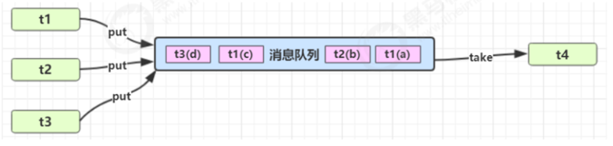

## 阻塞队列

```java
public static void main(String[] args) {
    ExecutorService consumer = Executors.newFixedThreadPool(1);
    ExecutorService producer = Executors.newFixedThreadPool(1);
    BlockingQueue<Integer> queue = new SynchronousQueue<>();
    producer.submit(() -> {
        try {
            System.out.println("生产...");
            Thread.sleep(1000);
            queue.put(10);
        } catch (InterruptedException e) {
            e.printStackTrace();
        }
    });
    consumer.submit(() -> {
        try {
            System.out.println("等待消费...");
            Integer result = queue.take();
            System.out.println("结果为:" + result);
        } catch (InterruptedException e) {
            e.printStackTrace();
        }
    });
}
```

# 内存

## JMM

### 内存模型

java的内存模型JMM，本身是一种`抽象的概念`，实际上并不存在，描述的是一组规则或规范，通过这组规范定义了程序中的各个变量
的访问方式。

_JMM作用_
  - 屏蔽各种硬件和操作系统的内存访问差异，实现让java程序在各种平台下都能达到一致的内存访问效果
  - 规定了线程和内存之间的一些关系

根据JMM设计。系统存在一个主内存。Java中所有变量都存储在主内存中，对所有的线程都是共享的：每条线程都有自己的共享内存。
工作内存中保存的是主内存中的某些`变量拷贝`，线程对所有变量的操作都是先对变量进行拷贝。然后在工作内存中进行。不能直接操作
主内存中的变量；线程之间无法相互直接访问。线程间通信必须通过主内存来完成。

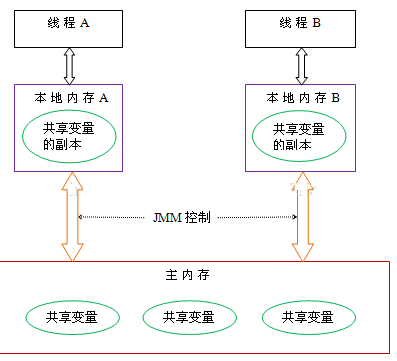

主内存和工作内存：

主内存：计算机的内存，也就是经常提到的 8G 内存，16G 内存，存储所有共享变量的值

工作内存：存储该线程使用到的共享变量在主内存的的值的副本拷贝

JVM 和 JMM 之间的关系：JMM 中的主内存、工作内存与 JVM 中的 Java 堆、栈、方法区等并不是同一个层次的内存划分，这两者基本上是没有关系的，如果两者一定要勉强对应起来：

主内存主要对应于 Java 堆中的对象实例数据部分，而工作内存则对应于虚拟机栈中的部分区域

从更低层次上说，主内存直接对应于物理硬件的内存，工作内存对应寄存器和高速缓存

### 内存交互

Java内存模型定义了8个操作来完成主内存和工作内存的交互操作，那个操作都是原子的

非原子协议=定：没有被volatile修饰的long，double外，默认按照两次32位操作

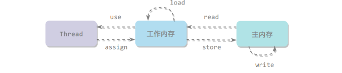

- lock：作用于主内存，将一个变量标识为被一个线程独占状态（对应monitorenter）
- unlock：作用于主内存，讲一个变量从独占状态释放出来，释放后变量才可以被其他线程锁定（对应monitorexit）
- read：作用于主内存，把一个变量值从主内存传输到动作内存中
- load：作用于工作内存，在read之后执行，把read得到的值放入工作内存的变量副本中
- use：作用于工作内存，把工作内存中的一个变量值传递给`执行引擎`，每当遇到s一个使用到变量的操作时都要使用该命令
- assign：作用于工作内存，把从执行引擎接收到的一个值赋给工作内存的变量
- store：作用于工作内存，把工作内存的一个变量的值传送到主内存中
- write：作用于主内存，在store之后执行，把store得到的值放入主内存的变量中

### 三大特征

_可见性_

可见性：是指多个线程访问同一个变量时，一个线程修改了这个变量的值，其他线程能够立即看到修改的值

存在不可见问题的根本原因是由于缓存的存在，线程持有的是共享变量副本，无法感知其他线程对于共享变量的更改。导致读取的值不是最新的。但是final修饰的变量是不可变的。就算
有缓存，也不会存在不可见的问题。

main线程对run变量的修改对于t线程不可见，导致t线程无法停止

```java
static boolean run = true;	//添加volatile
public static void main(String[] args) throws InterruptedException {
    Thread t = new Thread(()->{
        while(run){
        // ....
        }
	});
    t.start();
    sleep(1);
    run = false; // 线程t不会如预想的停下来
}
```

原因：

- 初始状态， t 线程刚开始从主内存读取了 run 的值到工作内存
- 因为 t 线程要频繁从主内存中读取 run 的值，JIT 编译器会将 run 的值缓存至自己工作内存中的高速缓存中，减少对主存中 run 的访问，提高效率
- 1 秒之后，main 线程修改了 run 的值，并同步至主存，而 t 是从自己工作内存中的高速缓存中读取这个变量的值，结果永远是旧值

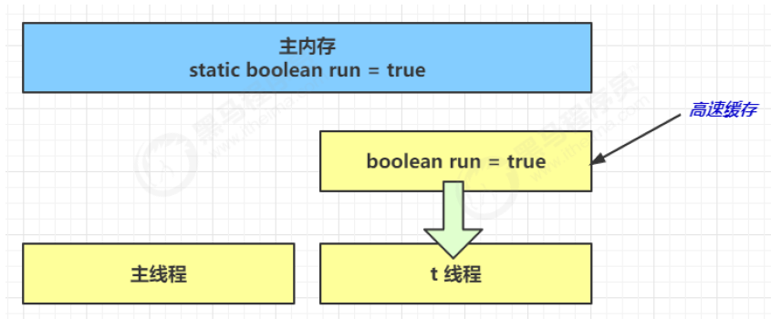

_原子性_

原子性：不可分割，完整性，也就是说某个线程正在做某个具体业务时，中间不可以被分割，需要具体完成，要么同时成功，要么同时失败，保证指令不会受到线程上下文切换的影响

定义原子操作的使用规则：

1. 不允许 read 和 load、store 和 write 操作之一单独出现，必须顺序执行，但是不要求连续
2. 不允许一个线程丢弃 assign 操作，必须同步回主存
3. 不允许一个线程无原因地（没有发生过任何 assign 操作）把数据从工作内存同步会主内存中
4. 一个新的变量只能在主内存中诞生，不允许在工作内存中直接使用一个未被初始化（assign 或者 load）的变量，即对一个变量实施 use 和 store 操作之前，必须先自行 assign 和 load 操作
5. 一个变量在同一时刻只允许一条线程对其进行 lock 操作，但 lock 操作可以被同一线程重复执行多次，多次执行 lock 后，只有执行相同次数的 unlock 操作，变量才会被解锁，lock 和 unlock 必须成对出现
6. 如果对一个变量执行 lock 操作，将会清空工作内存中此变量的值，在执行引擎使用这个变量之前需要重新从主存加载
7. 如果一个变量事先没有被 lock 操作锁定，则不允许执行 unlock 操作，也不允许去 unlock 一个被其他线程锁定的变量
8. 对一个变量执行 unlock 操作之前，必须先把此变量同步到主内存中（执行 store 和 write 操作）

_有序性_

有序性：在本线程内观察，所有操作都是有序的；在一个线程观察另一个线程，所有操作都是无序的，无序是因为发生了指令重排序

CPU 的基本工作是执行存储的指令序列，即程序，程序的执行过程实际上是不断地取出指令、分析指令、执行指令的过程，为了提高性能，编译器和处理器会对指令重排，一般分为以下三种：

```java
源代码 -> 编译器优化的重排 -> 指令并行的重排 -> 内存系统的重排 -> 最终执行指令
```

现代 CPU 支持多级指令流水线，几乎所有的冯•诺伊曼型计算机的 CPU，其工作都可以分为 5 个阶段：取指令、指令译码、执行指令、访存取数和结果写回，可以称之为五级指令流水线。CPU 可以在一个时钟周期内，同时运行五条指令的不同阶段（每个线程不同的阶段），本质上流水线技术并不能缩短单条指令的执行时间，但变相地提高了指令地吞吐率

处理器在进行重排序时，必须要考虑指令之间的数据依赖性

- 单线程环境也存在指令重排，由于存在依赖性，最终执行结果和代码顺序的结果一致
- 多线程环境中线程交替执行，由于编译器优化重排，会获取其他线程处在不同阶段的指令同时执行

补充知识：

- 指令周期是取出一条指令并执行这条指令的时间，一般由若干个机器周期组成
- 机器周期也称为 CPU 周期，一条指令的执行过程划分为若干个阶段（如取指、译码、执行等），每一阶段完成一个基本操作，完成一个基本操作所需要的时间称为机器周期
- 振荡周期指周期性信号作周期性重复变化的时间间隔

## cache

### 缓存机制

_缓冲结构_

在计算机系统中，CPU 高速缓存（CPU Cache，简称缓存）是用于减少处理器访问内存所需平均时间的部件；在存储体系中位于自顶向下的第二层，仅次于 CPU 寄存器；其容量远小于内存，但速度却可以接近处理器的频率

CPU 处理器速度远远大于在主内存中的，为了解决速度差异，在它们之间架设了多级缓存，如 L1、L2、L3 级别的缓存，这些缓存离 CPU 越近就越快，将频繁操作的数据缓存到这里，加快访问速度

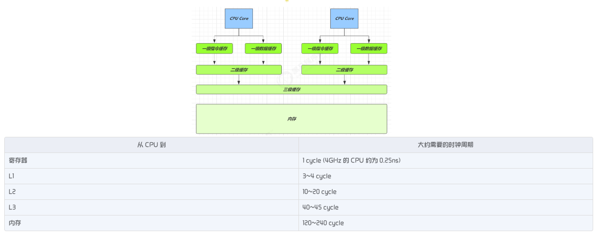

_缓存的使用_

当处理器发出内存访问请求时，会先查看缓存内是否有请求数据，如果存在（命中），则不用访问内存直接返回该数据；如果不存在（失效），则要先把内存中的相应数据载入缓存，再将其返回处理器

缓存之所以有效，主要因为程序运行时对内存的访问呈现局部性（Locality）特征。既包括空间局部性（Spatial Locality），也包括时间局部性（Temporal Locality），有效利用这种局部性，缓存可以达到极高的命中率

### 伪共享

缓存以缓存行 cache line 为单位，每个缓存行对应着一块内存，一般是 64 byte（8 个 long），在 CPU 从主存获取数据时，以 cache line 为单位加载，于是相邻的数据会一并加载到缓存中

缓存会造成数据副本的产生，即同一份数据会缓存在不同核心的缓存行中，CPU 要保证数据的一致性，需要做到某个 CPU 核心更改了数据，其它 CPU 核心对应的整个缓存行必须失效，这就是伪共享

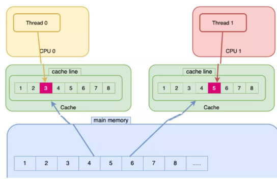

解决方法：

- padding：通过填充，让数据落在不同的 cache line 中

- @Contended：原理参考 无锁 → Adder → 优化机制 → 伪共享

### 缓存一致

缓存一致性：当多个处理器运算任务都涉及到同一块主内存区域的时候，将可能导致各自的缓存数据不一样

MESI（Modified Exclusive Shared Or Invalid）是一种广泛使用的支持写回策略的缓存一致性协议，CPU 中每个缓存行（caceh line）使用 4 种状态进行标记（使用额外的两位 bit 表示)：

- M：被修改（Modified）

    该缓存行只被缓存在该 CPU 的缓存中，并且是被修改过的，与主存中的数据不一致 (dirty)，该缓存行中的内存需要写回 (write back) 主存。该状态的数据再次被修改不会发送广播，因为其他核心的数据已经在第一次修改时失效一次
    
    当被写回主存之后，该缓存行的状态会变成独享 (exclusive) 状态

- E：独享的（Exclusive）

    该缓存行只被缓存在该 CPU 的缓存中，是未被修改过的 (clear)，与主存中数据一致，修改数据不需要通知其他 CPU 核心，该状态可以在任何时刻有其它 CPU 读取该内存时变成共享状态 (shared)
    
    当 CPU 修改该缓存行中内容时，该状态可以变成 Modified 状态

- S：共享的（Shared）

    该状态意味着该缓存行可能被多个 CPU 缓存，并且各个缓存中的数据与主存数据一致，当 CPU 修改该缓存行中，会向其它 CPU 核心广播一个请求，使该缓存行变成无效状态 (Invalid)，然后再更新当前 Cache 里的数据

- I：无效的（Invalid）

    该缓存是无效的，可能有其它 CPU 修改了该缓存行
    
解决方法：各个处理器访问缓存时都遵循一些协议，在读写时要根据协议进行操作，协议主要有 MSI、MESI 等

### 处理机制

单核 CPU 处理器会自动保证基本内存操作的原子性

多核 CPU 处理器，每个 CPU 处理器内维护了一块内存，每个内核内部维护着一块缓存，当多线程并发读写时，就会出现缓存数据不一致的情况。处理器提供：

- 总线锁定：当处理器要操作共享变量时，在 BUS 总线上发出一个 LOCK 信号，其他处理器就无法操作这个共享变量，该操作会导致大量阻塞，从而增加系统的性能开销（平台级别的加锁）
- 缓存锁定：当处理器对缓存中的共享变量进行了操作，其他处理器有嗅探机制，将各自缓存中的该共享变量的失效，读取时会重新从主内存中读取最新的数据，基于 MESI 缓存一致性协议来实现

有如下两种情况处理器不会使用缓存锁定：

- 当操作的数据跨多个缓存行，或没被缓存在处理器内部，则处理器会使用总线锁定

- 有些处理器不支持缓存锁定，比如：Intel 486 和 Pentium 处理器也会调用总线锁定

总线机制：

- 总线嗅探：每个处理器通过嗅探在总线上传播的数据来检查自己缓存值是否过期了，当处理器发现自己的缓存对应的内存地址的数据被修改，就将当前处理器的缓存行设置为无效状态，当处理器对这个数据进行操作时，会重新从内存中把数据读取到处理器缓存中

- 总线风暴：当某个 CPU 核心更新了 Cache 中的数据，要把该事件广播通知到其他核心（写传播），CPU 需要每时每刻监听总线上的一切活动，但是不管别的核心的 Cache 是否缓存相同的数据，都需要发出一个广播事件，不断的从主内存嗅探和 CAS 循环，无效的交互会导致总线带宽达到峰值；因此不要大量使用 volatile 关键字，使用 volatile、syschonized 都需要根据实际场景

## volatile

### 同步机制

volatile是Java虚拟机提供的轻量级的同步机制（三大特征）
  - 保证可见性
  - 不保证原子性
  - 保证有序性（禁止指令重排）

性能： volatile修饰的变量进行读操作与普通变量几乎没什么差异。但是写操作相对慢一些。因为需要在本地内存中插入很多
内存屏障来保证指令不会发生乱序执行。但是开销比锁要小。

synchronized无法禁止指令重排和处理器优化，为什么可以保证有序性可见性
  - 加了锁之后，只能有一个线程获得到了锁，获得不到锁的线程就要阻塞，所以同一时间只有一个线程执行，相当于单线程，由于数据依赖性的存在，单线程的指令重排是没有问题的
  - 线程加锁前，将清空工作内存中共享变量的值，使用共享变量时需要从主内存中重新读取最新的值；线程解锁前，必须把共享变量的最新值刷新到主内存中（JMM 内存交互章节有讲）

### 指令重排

volatile修饰的变量，可以禁用指令重排

指令重排实例1:

```java
public void mySort() {
	int x = 11;	//语句1
	int y = 12;	//语句2  谁先执行效果一样
	x = x + 5;	//语句3
	y = x * x;	//语句4
}
```

执行顺序是：1 2 3 4、2 1 3 4、1 3 2 4

指令重排也有限制不会出现：4321，语句 4 需要依赖于 y 以及 x 的申明，因为存在数据依赖，无法首先执行

实例2:

```java
int num = 0;
boolean ready = false;
// 线程1 执行此方法
public void actor1(I_Result r) {
    if(ready) {
    	r.r1 = num + num;
    } else {
    	r.r1 = 1;
    }
}
// 线程2 执行此方法
public void actor2(I_Result r) {
	num = 2;
	ready = true;
}
```

情况一：线程 1 先执行，ready = false，结果为 r.r1 = 1

情况二：线程 2 先执行 num = 2，但还没执行 ready = true，线程 1 执行，结果为 r.r1 = 1

情况三：线程 2 先执行 ready = true，线程 1 执行，进入 if 分支结果为 r.r1 = 4

情况四：线程 2 执行 ready = true，切换到线程 1，进入 if 分支为 r.r1 = 0，再切回线程 2 执行 num = 2，发生指令重排

### 底层原理

_缓存一致_

使用 volatile 修饰的共享变量，总线会开启 CPU 总线嗅探机制来解决 JMM 缓存一致性问题，也就是共享变量在多线程中可见性的问题，实现 MESI 缓存一致性协议

底层是通过汇编 lock 前缀指令，共享变量加了 lock 前缀指令就会进行缓存锁定，在线程修改完共享变量后写回主存，其他的 CPU 核心上运行的线程根据总线嗅探机制会修改其共享变量为失效状态，读取时会重新从主内存中读取最新的数据

lock 前缀指令就相当于内存屏障，Memory Barrier（Memory Fence）

  - 对 volatile 变量的写指令后会加入写屏障
  - 对 volatile 变量的读指令前会加入读屏障
  - 
内存屏障有三个作用：

  - 确保对内存的读-改-写操作原子执行
  - 阻止屏障两侧的指令重排序
  - 强制把缓存中的脏数据写回主内存，让缓存行中相应的数据失效

_内存屏障_

保证可见性：
    
  - 写屏障（sfence，Store Barrier）保证在该屏障之前的，对共享变量的改动，都同步到主存当中

```java
public void actor2(I_Result r) {
    num = 2;
    ready = true; // ready 是 volatile 赋值带写屏障
    // 写屏障
}
```

  - 读屏障（lfence，Load Barrier）保证在该屏障之后的，对共享变量的读取，从主存刷新变量值，加载的是主存中最新数据

```java
public void actor1(I_Result r) {
    // 读屏障
    // ready 是 volatile 读取值带读屏障
    if(ready) {
    	r.r1 = num + num;
    } else {
    	r.r1 = 1;
    }
}
```

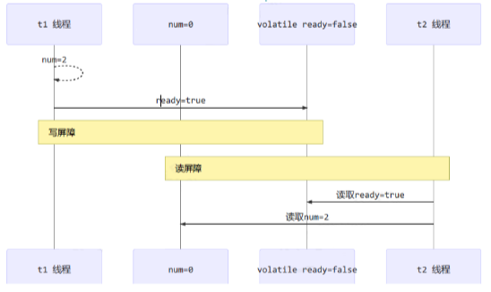

  - 全能屏障：mfence（modify/mix Barrier），兼具 sfence 和 lfence 的功能

_保证有序性_

  - 写屏障会确保指令重排序时，不会将写屏障之前的代码排在写屏障之后
  - 读屏障会确保指令重排序时，不会将读屏障之后的代码排在读屏障之前

不能解决指令交错
  - 写屏障仅仅是保证之后的读能够读到最新的结果，但不能保证其他线程的读跑到写屏障之前
  - 有序性的保证也只是保证了本线程内相关代码不被重排序

```java
volatile i = 0;
new Thread(() -> {i++});
new Thread(() -> {i--});
```

i++ 反编译后的指令：

```java
0: iconst_1			// 当int取值 -1~5 时，JVM采用iconst指令将常量压入栈中
1: istore_1			// 将操作数栈顶数据弹出，存入局部变量表的 slot 1
2: iinc		1, 1
```

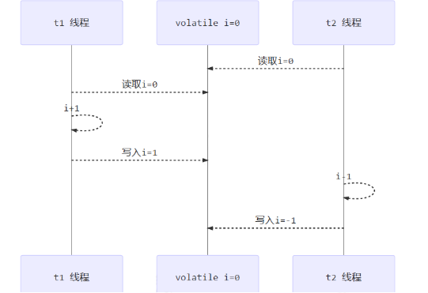

_交互规则_

对于 volatile 修饰的变量：
  - 线程对变量的 use 与 load、read 操作是相关联的，所以变量使用前必须先从主存加载
  - 线程对变量的 assign 与 store、write 操作是相关联的，所以变量使用后必须同步至主存
  - 线程 1 和线程 2 谁先对变量执行 read 操作，就会先进行 write 操作，防止指令重排

### 双端检锁

_检锁机制_

